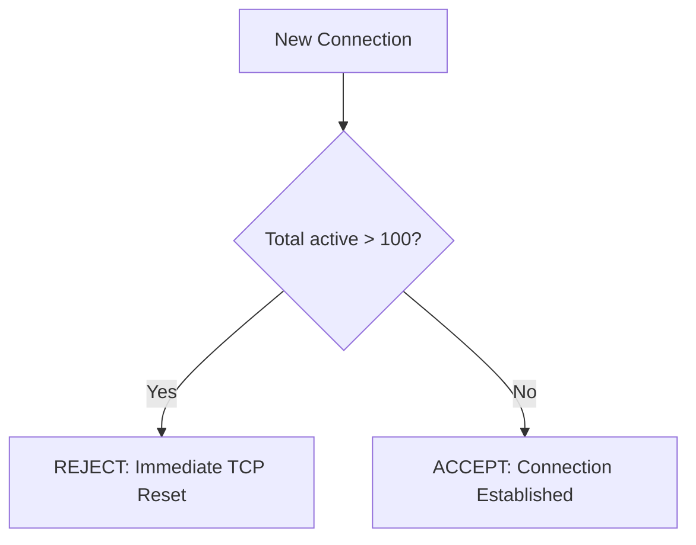
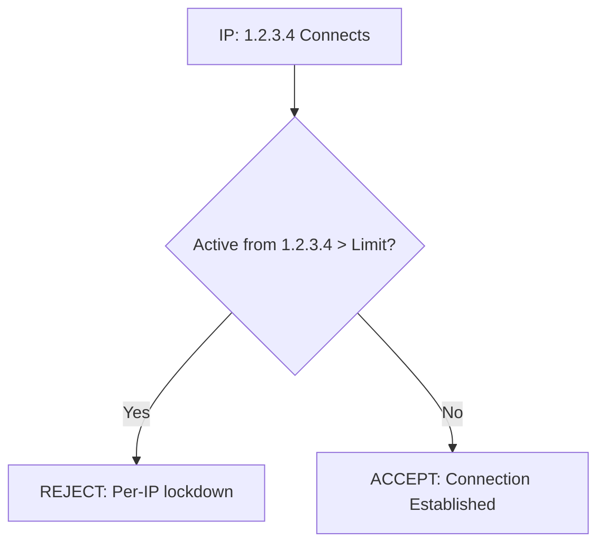
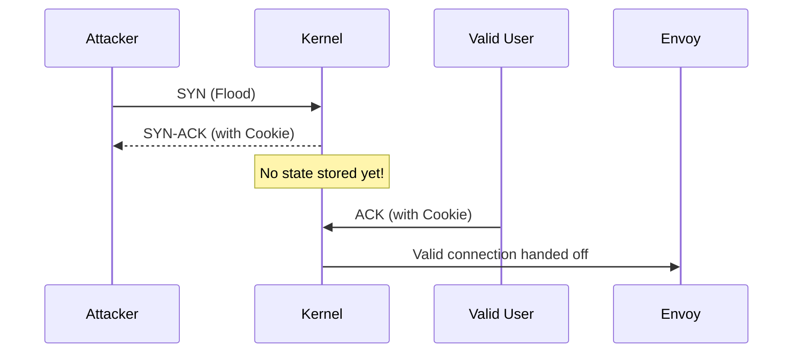
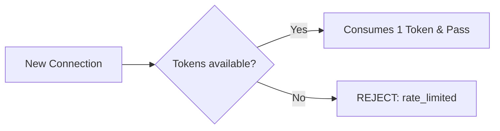
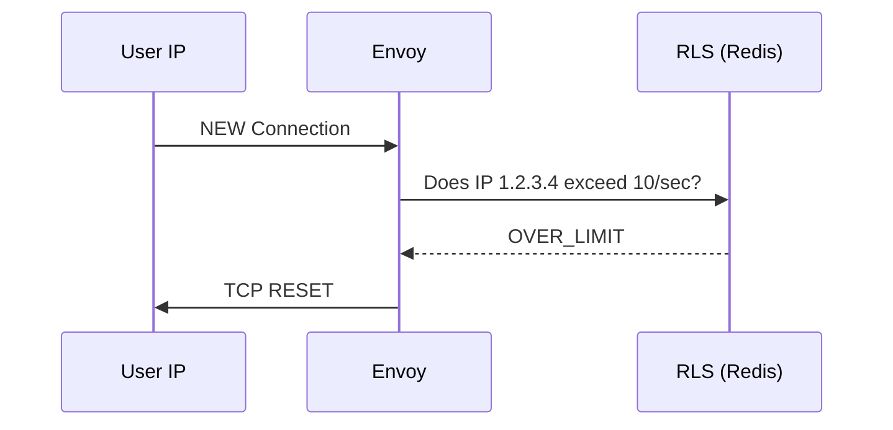

# TCP Protection Layers: Demo Guide

This guide describes the six layers of TCP protection configured on this system to ensure High Availability and DDoS resilience.

## Summary Table

| Limit | Type | Scope | Implemented By | Target Config |
| :--- | :--- | :--- | :--- | :--- |
| **Max Connections** | Global | Pod/Cluster | Envoy (Overload Mgr) | `max_active_downstream_connections` |
| **Max Connections** | Individual | Per Source IP | Envoy (ClientTraffic) | `connectionLimit` |
| **Max Half-Open** | Global | System | Linux Kernel | `net.ipv4.tcp_syncookies` |
| **Max Half-Open** | Individual | Per Source IP | Linux Kernel | `net.ipv4.tcp_max_syn_backlog` |
| **Connection Rate** | Global | Pod/Cluster | Envoy (Network Filter) | `local_ratelimit` |
| **Connection Rate** | Individual | Per Source IP | Envoy (RLS/Redis) | `ratelimit` |

---

## 1. Max Connections (Global)
**Purpose**: Prevents the Envoy pod from running out of memory/FDs by capping the absolute total number of active connections.

### Implementation
- **Component**: Envoy Overload Manager
- **Config**: `envoy-gateway-tenant.yaml`
```yaml
overload_manager:
  resource_monitors:
    - name: envoy.resource_monitors.global_downstream_max_connections
      typed_config:
        max_active_downstream_connections: 100
```

### Visual Flow


### Testing Proof
**Command**: `./tcp-load.py -c 300 -rate 60`
**Result**: `Successfully opened 200 active connections. (100 failed)`
*Note: Result is 200 because we have 2 replicas (100 per pod).*

---

## 2. Max Connections (Individual)
**Purpose**: Prevents a single attacker from hoarding all available connection slots.

### Implementation
- **Component**: Envoy `ClientTrafficPolicy`
- **Config**: `tcp-connection-limits.yaml`
```yaml
spec:
  connection:
    connectionLimit:
      value: 1000
```

### Visual Flow


---

## 3. Max Half-Open (Global)
**Purpose**: Protects against SYN Floods (connections that never finish the 3-way handshake).

### Implementation
- **Component**: Linux Kernel
- **Config**: `/etc/sysctl.conf`
```bash
net.ipv4.tcp_syncookies = 1
```

### Visual Flow


---

## 4. Max Half-Open (Individual)
**Purpose**: Caps how many pending handshakes a single IP can have.

### Implementation
- **Component**: Linux Kernel (`tcp_max_syn_backlog`)
- **Config**: `/etc/sysctl.conf`
```bash
net.ipv4.tcp_max_syn_backlog = 1024
```

---

## 5. Connection Rate (Global)
**Purpose**: Limits the speed (CPS) of new connection attempts to prevent CPU spikes.

### Implementation
- **Component**: Envoy `local_ratelimit` (Network Filter)
- **Config**: `tcp-rate-limits.yaml`
```yaml
token_bucket:
  max_tokens: 50
  tokens_per_fill: 50
  fill_interval: 1s
```

### Visual Flow


### Testing Proof
**Command**: `./tcp-load.py -c 500` (without `-rate` flag)
**Result**: Counter `local_rate_limit.tcp_conn_rate_global_https.rate_limited` increases by 400.

---

## 6. Connection Rate (Individual)
**Purpose**: Limits connection speed per Source IP to isolate abusive clients.

### Implementation
- **Component**: Envoy `ratelimit` + Redis
- **Config**: `tcp-rate-limits.yaml`
```yaml
descriptors:
  - entries:
      - key: remote_address
        value: "%DOWNSTREAM_REMOTE_ADDRESS_WITHOUT_PORT%"
```

### Visual Flow

