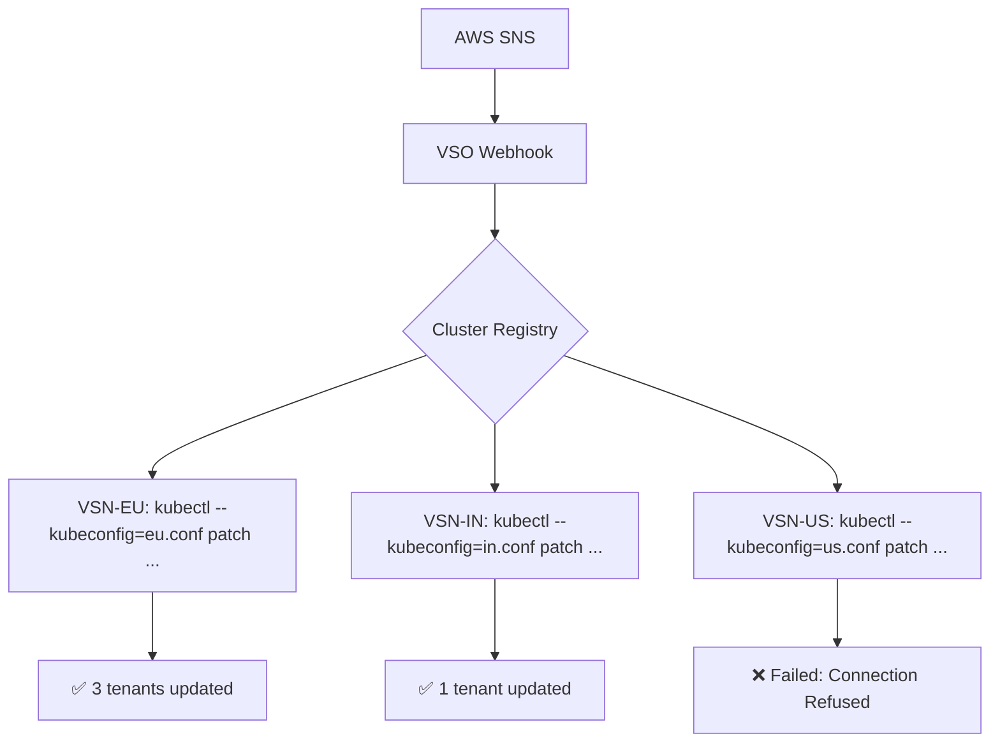

# IP Refresh Design Document
## Vishanti Cloud Platform — CloudFront & Cloudflare IP Whitelisting Automation

**Version:** 1.0  
**Status:** Design Review  
**Scope:** Multi-tenant, Multi-cluster IP Rotation Management

---

## 1. Problem Statement

CDNs (Amazon CloudFront, Cloudflare) rotate their edge server IP ranges periodically. When a tenant's Application Load Balancer (ALB) uses `loadBalancerSourceRanges` to whitelist CDN traffic, outdated IP ranges cause legitimate CDN traffic to be dropped — resulting in customer-facing downtime.

The IP Refresh System must solve:
- How to **detect** IP range changes automatically.
- How to **apply** those changes to the correct tenant(s) without disruption.
- How to handle **multi-tenant**, **multi-cluster**, and **link-failure** scenarios.

---

## 2. CDN Data Sources

Each CDN publishes its IP ranges differently. The system must support both.

### 2.1 Amazon CloudFront

| Property | Value |
| :--- | :--- |
| **Source URL** | `https://ip-ranges.amazonaws.com/ip-ranges.json` |
| **Change Notification** | AWS SNS Topic: `arn:aws:sns:us-east-1:806199016981:AmazonIpSpaceChanged` |
| **Filter Field** | `"service": "CLOUDFRONT"` |
| **Update Frequency** | ~Every 10 hours |

**Fetching Process:**
1. AWS SNS sends a `POST` notification to the webhook.
2. Webhook validates the AWS cryptographic signature.
3. Parses the `ip-ranges.json` payload embedded in the SNS `Message` body.
4. Extracts only `CLOUDFRONT` service prefixes.

### 2.2 Cloudflare

| Property | Value |
| :--- | :--- |
| **IPv4 Source URL** | `https://www.cloudflare.com/ips-v4` |
| **IPv6 Source URL** | `https://www.cloudflare.com/ips-v6` |
| **Change Notification** | No native webhook. Must poll periodically. |
| **Update Frequency** | Rare, but no guaranteed schedule. |

**Fetching Process:**
1. A scheduled job (CronJob on VSO) polls both endpoints every 4 hours.
2. Parses the raw newline-separated IP list.
3. Computes a hash of the fetched list and compares to the last stored hash.
4. If changed, triggers the same update path as the SNS webhook.

---

## 3. Tenant Provisioning Flow

### 3.1 Single Tenant: Initial ALB Setup

When a new tenant onboards and enables CDN whitelisting, the operator follows this sequence:

```
Step 1 — Provision Tenant Resources:
  - Create namespace (e.g., tenant-acme)
  - Deploy CiliumGatewayClassConfig (without any CIDRs)
  - Deploy Gateway (produces the LoadBalancer Service)
  - Deploy HTTPRoute

Step 2 — Opt-in to CDN Whitelisting:
  Apply the label to their CiliumGatewayClassConfig:

  kubectl label ciliumgatewayclassconfig <config-name> \
    vishanti.io/provider=cloudfront \
    -n tenant-acme

Step 3 — Force Initial Sync:
  The VSO operator triggers a force-update to immediately
  populate the correct CIDRs for the tenant.

  curl -X POST https://webhook.incubera.xyz/webhook/force-update \
    -H "Authorization: Bearer <TOKEN>"

Step 4 — Verify:
  kubectl get ciliumgatewayclassconfig <config-name> -n tenant-acme \
    -o jsonpath='{.spec.service.loadBalancerSourceRanges}' | jq '. | length'
  # Should return > 0 (e.g., 187 for CloudFront)
```

### 3.2 Multi-Tenant Provisioning

In a cluster serving multiple tenants on different CDNs, the label scheme acts as the routing key:

| Label | Meaning |
| :--- | :--- |
| `vishanti.io/provider: cloudfront` | Webhook updates with AWS CloudFront CIDRs. |
| `vishanti.io/provider: cloudflare` | CronJob updates with Cloudflare CIDRs. |
| *(no label)* | Not managed — static or manually maintained. |

The webhook independently handles each provider:

```
┌──────────────────────────────────────────────────────────────┐
│                    VSO Webhook                               │
│                                                              │
│  ┌─────────────────────┐   ┌──────────────────────────────┐  │
│  │  CloudFront Handler │   │   Cloudflare Poller (Cron)   │  │
│  │                     │   │                              │  │
│  │  Triggered by SNS   │   │  Runs every 4 hours          │  │
│  └────────┬────────────┘   └───────────┬──────────────────┘  │
│           │                            │                      │
│           ▼                            ▼                      │
│     Label Filter:               Label Filter:                 │
│  provider=cloudfront           provider=cloudflare            │
└───────────────────────────────────────────────────────────────┘
```

---

## 4. Data Plane Update Mechanism

### 4.1 Update Flow

When a rotation event occurs, the propagation path is:

```
1. SNS / CronJob  →  2. VSO Webhook App  →  3. CiliumGatewayClassConfig (VSN)
        →  4. Cilium Operator watches CRD change
        →  5. Cilium Operator patches LoadBalancer Service (.spec.loadBalancerSourceRanges)
        →  6. Cilium eBPF XDP/TC programs recompiled on Node
        →  7. New firewall rules active — OLD rules retired
```

### 4.2 Traffic Impact Analysis

**Is there disruption to existing connections?**

| Scenario | Impact |
| :--- | :--- |
| **New CloudFront IPs being added** | Zero disruption. Existing connections from old IPs remain active until natural teardown. New IPs are allowed immediately. |
| **Old CloudFront IPs being removed** | Connections from retired IPs will be dropped at the network layer. CloudFront will retry from a new active IP (CloudFront handles failover transparently). |
| **ALB Pod (Envoy) during update** | **Zero.** `loadBalancerSourceRanges` is enforced at the Node's eBPF layer, not inside the Pod. Envoy pods are **not restarted**. |
| **LB Service Recreation** | **Avoided.** The current implementation uses JSON patch on `CiliumGatewayClassConfig`, allowing the Cilium Operator to update in-place. Service deletion is no longer triggered. |

> **Key Design Decision:** Cilium's eBPF-based enforcement means IP whitelist updates are applied at the network interface level (XDP). This is hot-swappable — no pods restart, no connections drop due to the config change itself.

### 4.3 Idempotency

Each update cycle:
1. **Fetches** the current `loadBalancerSourceRanges` from the live cluster.
2. **Compares** sorted new CIDRs vs. sorted current CIDRs.
3. **Skips** the patch entirely if identical.
4. **Replaces** the full list atomically if different.

This means the system is **safe to re-run at any time** without risk of creating duplicates or partial states.

---

## 5. Multi-Cluster Architecture (VSO → Multiple VSNs)

### 5.1 The Challenge

A single VSO managing 10+ VSN clusters cannot use a single `kubeconfig`. Each VSN requires:
- Independent kubeconfig secret.
- Independent RBAC with minimum-required permissions.
- Independent retry/backoff tracking.

### 5.2 Proposed Design: Cluster Registry

Instead of hardcoding a single `vsn-kubeconfig`, the VSO webhook should maintain a **Cluster Registry** — a `ConfigMap` mapping cluster identifiers to their kubeconfig secrets:

```yaml
# cluster-registry ConfigMap (on VSO)
apiVersion: v1
kind: ConfigMap
metadata:
  name: vsn-cluster-registry
  namespace: cloudfront-webhook
data:
  clusters: |
    - id: vsn-eu-west-1
      kubeconfig_secret: vsn-eu-west-1-kubeconfig
    - id: vsn-in-south-1
      kubeconfig_secret: vsn-in-south-1-kubeconfig
    - id: vsn-us-east-1
      kubeconfig_secret: vsn-us-east-1-kubeconfig
```

### 5.3 Multi-Cluster Update Flow

When an IP rotation is detected:
1. Read the cluster registry to get all managed VSNs.
2. For each VSN, load its kubeconfig from the corresponding secret.
3. Execute the label-based discovery and patch independently per cluster.
4. Track success/failure per cluster in the status report.
5. **Do not abort** if one cluster fails — continue to the others.



---

## 6. VSO → VSN Link Failure Handling

### 6.1 Failure Scenarios

| Scenario | Risk |
| :--- | :--- |
| Network partition between VSO and VSN | VSN keeps old CIDRs. New CloudFront IPs are blocked. |
| VSN API Server down during rotation | Patch fails silently. VSN drifts from expected state. |
| kubeconfig token expired | All operations fail with 401 Unauthorized. |
| VSN Cilium Operator crash | Config patched but not enforced. |

### 6.2 Failsafe Design: Local Agent on VSN

The critical insight is:

> **When the VSO-VSN link is broken, the VSN has no way to self-heal using the current purely centralized model.**

The recommended hybrid design is:

#### Primary Path (Connected): VSO Orchestrates
- VSO receives SNS notification.
- VSO pushes patches to all VSNs via kubeconfig.
- VSNs update immediately.

#### Fallback Path (Disconnected): VSN Local Agent
Each VSN runs a lightweight **Local Fallback Agent** (LFA) as a `CronJob`:

```yaml
apiVersion: batch/v1
kind: CronJob
metadata:
  name: cloudfront-ip-local-sync
  namespace: vishanti-system
spec:
  schedule: "0 */6 * * *"   # Every 6 hours
  jobTemplate:
    spec:
      template:
        spec:
          containers:
          - name: local-sync
            image: cloudfront-webhook:v2.1
            command: ["python", "local_sync.py"]
            env:
            - name: MODE
              value: "local"   # Uses in-cluster kubeconfig, not vsn-kubeconfig
```

**Behavior of the LFA:**
1. Fetches fresh IPs directly from `https://ip-ranges.amazonaws.com/ip-ranges.json`.
2. Compares with current `CiliumGatewayClassConfig` on the local VSN.
3. Updates only if different.
4. Does **not** need VSO connectivity at all.

#### Comparison: Centralized vs. Local vs. Hybrid

| Property | VSO-Only (Current) | VSN-Local Only | Hybrid (Recommended) |
| :--- | :--- | :--- | :--- |
| **Single point of control** | ✅ | ❌ | ✅ (VSO primary) |
| **Resilient to link failure** | ❌ | ✅ | ✅ (LFA fallback) |
| **Real-time on SNS event** | ✅ | ❌ (poll-based) | ✅ |
| **Multi-CDN per tenant** | ✅ | Harder | ✅ |
| **Operational complexity** | Low | Medium | Medium |

### 6.3 Conflict Resolution

If both VSO and LFA run simultaneously, a **Last-Write-Wins** conflict could occur. To prevent this:

- **VSO patches always take priority.**
- LFA should check a "managed-by" annotation on the config:
  ```yaml
  annotations:
    vishanti.io/last-synced-by: "vso"
    vishanti.io/last-synced-at: "2026-04-14T02:57:16Z"
  ```
- LFA only overwrites if `last-synced-at` is older than 8 hours (indicating VSO is unreachable).

---

## 7. Alerting & Observability

### 7.1 Metrics (Proposed Prometheus Counters)

| Metric | Description |
| :--- | :--- |
| `cfwebhook_updates_total` | Total successful updates across all tenants. |
| `cfwebhook_failures_total` | Total failed patch operations. |
| `cfwebhook_clusters_unreachable` | Count of VSNs that couldn't be reached. |
| `cfwebhook_cidrs_current` | Current count of CIDRs in the whitelist. |
| `cfwebhook_last_sync_age_seconds` | Time since the last successful update. |

### 7.2 Critical Alert Conditions

| Condition | Action |
| :--- | :--- |
| `cfwebhook_last_sync_age_seconds > 43200` (12h) | 🚨 Page On-Call. VSN may have stale IPs. |
| `cfwebhook_clusters_unreachable > 0` | 🔔 Slack Alert. VSO-VSN link may be broken. |
| `cfwebhook_failures_total` increasing | 🔔 Slack Alert. Review kubectl and RBAC. |

---

## 8. Summary: Design Decisions

| Decision | Rationale |
| :--- | :--- |
| **VSO as primary orchestrator** | Avoids circular dependency where VSN firewall blocks its own update signals. |
| **Label-based tenant discovery** | Zero configuration for VSO — tenants self-register by labeling their configs. |
| **Atomic batch replacement** | Ensures consistent state. Avoids "half-updated" whitelists that could block traffic. |
| **No Pod restart on update** | Cilium eBPF enforcement is applied at the host network layer, completely independent of the application layer. |
| **Hybrid LFA fallback** | Prevents a VSO outage from causing permanent traffic failures at the VSN level. |
| **Per-cluster registry** | Allows a single VSO to independently manage multiple VSN clusters with separate credentials. |
