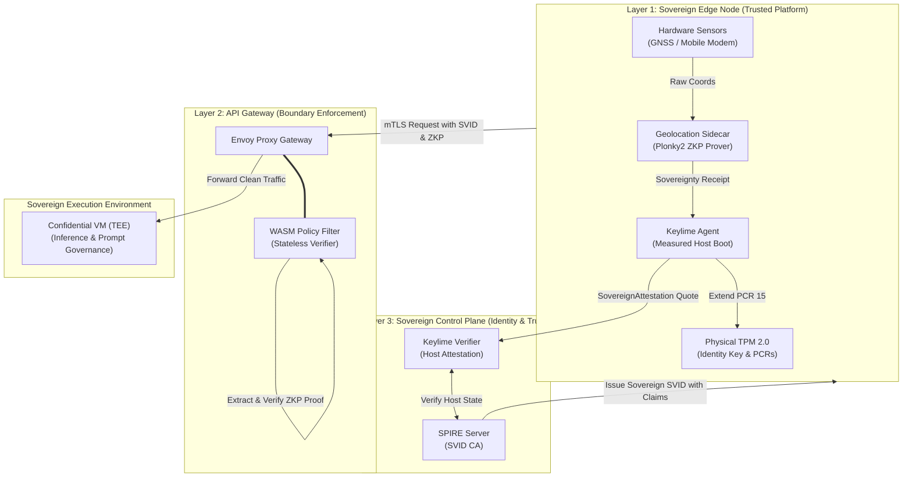
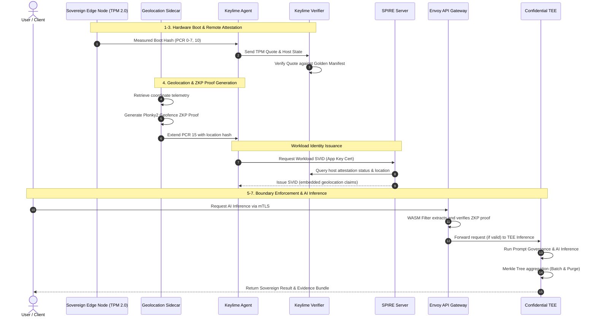
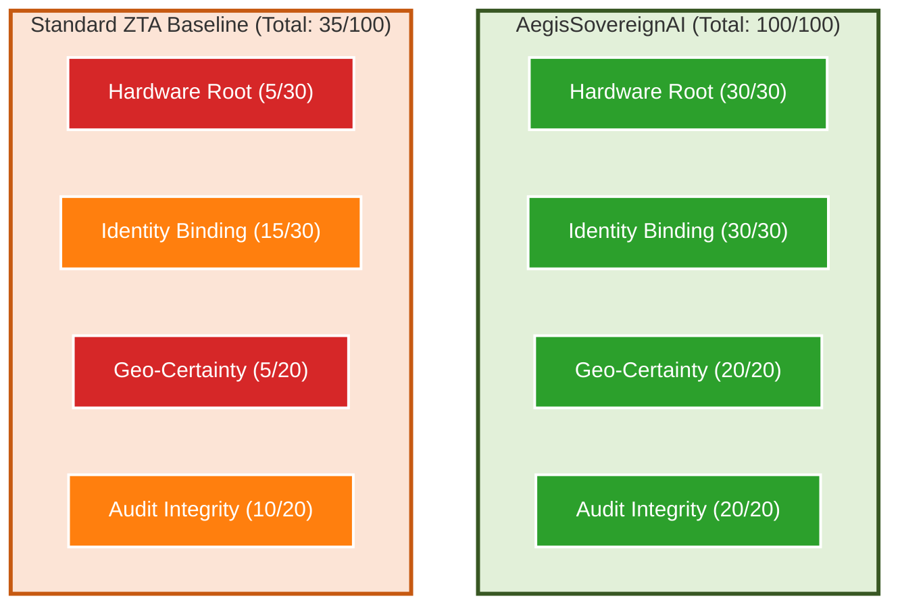
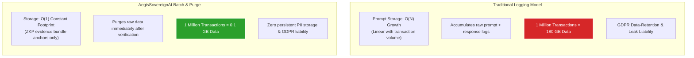
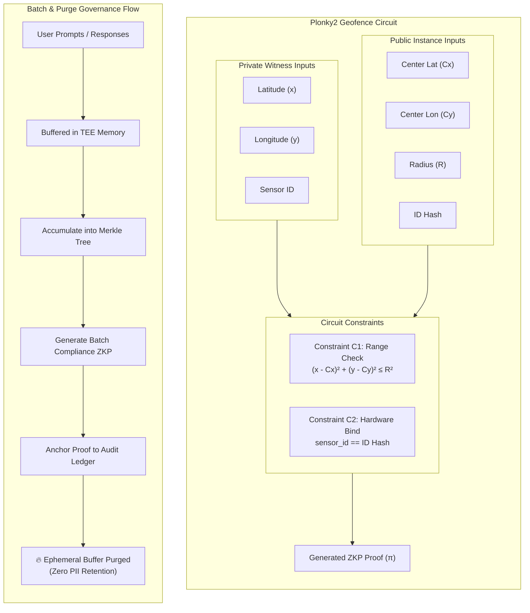

# AegisSovereignAI: A Hardware-Rooted Unified Identity Framework for Privacy-Preserving AI Governance in Sovereign Distributed Systems

---

## Abstract

The deployment of artificial intelligence (AI) across distributed infrastructures from centralized data centers to far-edge devices has exposed a critical accountability gap in security and governance. Conventional security models relying on bearer tokens and IP-based geofencing are inadequate for regulated environments such as financial services and healthcare: they are susceptible to replay attacks and location spoofing, and they create a privacy paradox wherein proving regulatory data-residency compliance requires ingesting sensitive location data, thereby violating data minimization principles. This paper introduces AegisSovereignAI, a hardware-rooted unified identity framework that establishes a contiguous sovereign trust loop across the AI operational lifecycle. The architecture cryptographically fuses silicon-level attestation via Trusted Platform Modules (TPM 2.0) and Trusted Execution Environments (TEEs) with extensible workload identities conforming to the Secure Production Identity Framework for Everyone (SPIFFE) and the SPIFFE Runtime Environment (SPIRE) standard (SPIFFE/SPIRE). A central novelty is the integration of zero-knowledge proofs (ZKPs) using the Plonky2 proving system for privacy-preserving geofencing, enabling mathematical verification of geographic data residency without exposing raw coordinates. The framework further introduces a Batch & Purge governance model that cryptographically audits AI prompt and output integrity while permanently eliminating sensitive audit data retention. Through a hybrid cloud reference implementation evaluated across five experimental scenarios, AegisSovereignAI produces exportable, audit-ready Evidence Bundles, transforming qualitative security assertions into continuous, verifiable mathematical guarantees that bridge the gap between infrastructure security and regulatory compliance.

**Keywords:** hardware-rooted attestation; zero-knowledge proofs; workload identity; confidential computing; AI governance

---

## 1. Introduction

The rapid proliferation of AI across the modern enterprise has precipitated a fundamental shift in how organizations conceptualize security, privacy, and digital sovereignty [1]. As AI workloads migrate from centralized hyperscale data centers to far-edge deployments, the complexity of maintaining a consistent and verifiable security posture grows substantially [2]. This challenge is particularly acute in highly regulated sectors financial services, healthcare, and national defense where generative artificial intelligence (AI) and Large Language Models (LLMs) represent both a competitive imperative and a formidable regulatory challenge [3]. In these environments, traditional data-center perimeters have dissolved, replaced by a cloud-to-edge continuum across which sensitive data and proprietary model weights must be protected on heterogeneous and frequently untrusted infrastructure [4].

The rise of distributed AI in regulated environments has exposed a critical disconnect between the requirements of modern governance and the capabilities of legacy security architectures. While organizations are eager to leverage AI for applications such as private wealth advisory, remote clinical diagnostics, and automated defense logistics, they confront a landscape of infrastructure blind spots [5]. These arise when the underlying hardware and operating system state are decoupled from the application-level identity, enabling sophisticated attacks including location spoofing, identity replay, and infrastructure-level tampering that bypass software-only security controls [6]. As a result, the promise of zero-trust architecture frequently remains unrealized, as existing implementations rely on non-binding credentials that fail to account for the physical provenance of the execution environment [1].

Current security and compliance challenges are further compounded by stringent global regulatory frameworks. The European Union (EU) AI Act mandates rigorous transparency and data governance standards for high-risk AI systems [3]. The National Institute of Standards and Technology (NIST) AI Risk Management Framework (AI RMF 1.0) emphasizes validity, reliability, and security throughout the AI lifecycle with a strong accountability focus [7]. In the financial sector, Regulation K (Reg-K) and the Office of the Comptroller of the Currency's (OCC) guidance on Model Risk Management (Supervisory Letter SR 11-7) require absolute certainty regarding data residency and model integrity [9, 10]. Satisfying these requirements through traditional methods, however, creates a privacy paradox: the more granular the audit data collected to prove compliance, the greater the risk of ingesting and storing sensitive personally identifiable information (PII), thereby creating new liability under the General Data Protection Regulation (GDPR) [8].

The limitations of existing approaches are particularly evident when applied to sovereign AI requirements. Legacy identity mechanisms such as bearer tokens issued via OAuth 2.0 function as physical keys that are trivially replayed upon interception [9]. Common geolocation techniques relying on IP-based geofencing are circumvented through residential virtual private networks (VPNs) or proxy servers [10]. In distributed AI systems, these vulnerabilities allow a malicious actor to appear within a compliant "Green Zone" while physically operating from an unauthorized jurisdiction. Furthermore, fragmented governance models lack a unified chain of trust extending from physical silicon to final AI output, producing an accountability gap: an organization may prove that a user was authenticated but cannot prove that the executing hardware was untampered or that the AI model had not been subtly modified by a compromised hypervisor [11].

This accountability gap is further complicated by what we term the "Silicon Lottery" a phenomenon wherein identical AI models produce divergent outputs when executed on different hardware architectures (e.g., NVIDIA A100 vs. H100) due to variations in floating-point arithmetic and parallel execution paths [12]. For quantitative risk management and regulatory reproducibility, computational determinism is essential. Without a mechanism binding a workload to a specific, validated hardware state, enterprises cannot guarantee that regulated models perform as validated [13].

The motivation for this work arises from the urgent need to resolve this gap by fusing infrastructure security with AI governance. We posit that a truly sovereign system must provide mathematical proof of compliance rather than relying on qualitative assertions or manipulable logs [14]. Such a system must satisfy three concurrent requirements: (1) verify the physical integrity of the hardware; (2) bind the workload identity to that verified state; and (3) prove that application logic including AI prompts and outputs adheres to mandatory safety and residency policies without disclosing proprietary intellectual property or retaining sensitive PII.

In response, we introduce AegisSovereignAI, a hardware-rooted unified identity framework and control plane designed to establish a sovereign trust loop across the distributed enterprise. The core innovation lies in the cryptographic fusion of silicon-level attestation with application-level governance. By leveraging TPM 2.0 and Trusted Execution Environments (TEEs) as the root of trust, the system issues short-lived, hardware-bound SPIFFE Verifiable Identity Documents (SVIDs) through the SPIFFE/SPIRE standard [5, 15]. These identities are not merely credentials; they are cryptographic artifacts carrying verified claims regarding the host's hardware integrity, geographic location, and compliance state.

The main contributions of this work are as follows:

1. **Unified Three-Layer Architecture.** A novel architecture integrating Infrastructure Security (Layer 1), Unified Identity (Layer 2), and AI Governance (Layer 3) into a single contiguous chain of trust, ensuring AI operations are anchored in verifiable silicon and effectively eliminating infrastructure blind spots.
2. **Privacy-Preserving Geofencing.** A verifiable geofencing mechanism based on zero-knowledge proofs (ZKPs) using the Plonky2 proving system [11], enabling cryptographic verification of geographic data-residency compliance (e.g., Reg-K) without ingesting or storing raw GPS coordinates, thereby resolving the residency–privacy deadlock.
3. **Verifiable AI Governance via Batch & Purge.** A methodology for cryptographically auditing AI prompts and outputs by generating batch compliance proofs and immediately purging raw data, enabling audit without disclosure and allowing regulators to verify AI interaction integrity without exposure to proprietary model logic or retained PII.
4. **Sovereign Hybrid Cloud Reference Implementation.** A comprehensive reference implementation and proof-of-concept (PoC) demonstrating a contiguous chain of trust between public cloud and sovereign private cloud, with integration of the Internet Engineering Task Force (IETF) Workload Identity in Multi-System Environments (WIMSE) standards [16].

The remainder of this paper is organized as follows. Section 2 reviews related work. Section 3 details the system architecture. Section 4 describes the methodology. Section 5 presents the experimental setup and evaluation. Section 6 presents results, analysis, and discussion. Section 7 discusses applications and future work. Section 8 concludes the paper.

---

## 2. Literature Review

As AI models migrate from centralized, high-security data centers to the far edge, traditional perimeter-based security has proven increasingly insufficient, prompting a transition toward zero trust architectures (ZTA) that prioritize continuous verification over static boundaries [3, 4]. This section surveys existing literature across these critical layers, identifies limitations of current approaches, and positions AegisSovereignAI within the evolving landscape of verifiable and sovereign AI infrastructure.

### 2.1 AI Infrastructure Security and Zero Trust

The security of AI infrastructure is increasingly framed through the lens of zero trust, a paradigm codified in NIST Special Publication 800-207 [1]. As noted by Kumar et al., compromised hypervisors or operating systems can manipulate model inputs or extract sensitive weights without triggering application-level alerts [1, 13]. Recent research has consequently emphasized the necessity of a contiguous chain of trust extending from hardware to the application layer to mitigate infrastructure blind spots [7].

Existing identity mechanisms in distributed systems frequently rely on bearer tokens defined by OAuth 2.0 [9]. While widely adopted, these tokens are decoupled from the physical state of the executing machine, enabling token replay attacks and identity spoofing particularly in hybrid cloud environments where edge hosts are afforded lower implicit trust than core data center infrastructure [8]. Researchers have argued that true sovereignty in AI requires fusing application-level identity with hardware-level state measurements, ensuring workloads execute exclusively on verified, authorized platforms [12, 17].

However, a critical limitation of the NIST 800-207 Zero Trust framework is its implicit assumption that the "Policy Enforcement Point" (PEP) itself operates on trusted infrastructure. The standard provides extensive guidance on network segmentation and identity verification but does not prescribe mechanisms for verifying the physical integrity of the hardware hosting the PEP or the AI workload [1]. This "trusted infrastructure" assumption becomes untenable in edge and hybrid cloud environments where the enterprise does not control the physical data center. BeyondCorp and similar enterprise ZTA implementations further illustrate this gap: while they successfully eliminate implicit network trust, they continue to rely on software-only device certificates and endpoint agents that can be compromised by a sufficiently privileged adversary operating below the OS layer [18].

AegisSovereignAI directly addresses this foundational limitation by extending the zero trust boundary downward into the silicon. Rather than assuming the PEP's host is trustworthy, the framework requires cryptographic proof of hardware integrity via TPM 2.0 attestation and IMA/EVM measurements before any workload identity is issued [5, 15]. This ensures that the zero trust model is not merely "software-deep" but "silicon-deep," closing the infrastructure blind spot that existing ZTA frameworks leave open.

### 2.2 Hardware-Rooted Trust and Remote Attestation

Hardware-rooted trust provides the foundational security layer for verifiable systems by anchoring software measurements in an immutable physical root [5, 13]. The Trusted Platform Module (TPM 2.0) has emerged as the industry standard for securing platform measurements through Platform Configuration Registers (PCRs) and cryptographic signing [5, 14]. Sailer et al. demonstrated how the Linux kernel's Integrity Measurement Architecture (IMA) can measure the software stack and provide a verifiable quote to a remote verifier [19, 20]. Building on this foundation, the Keylime project introduced a scalable remote attestation framework enabling continuous monitoring of distributed nodes, supporting real-time detection of software drift or unauthorized modifications [15, 21].

While remote attestation effectively verifies software state, its integration into high-level application workflows remains fragmented [22]. Most existing systems treat attestation as a periodic "health check" rather than a prerequisite for every transactional identity issuance [23].

A significant limitation of current remote attestation frameworks including Keylime in its upstream configuration is the absence of a native mechanism to translate attestation outcomes into application-layer identity decisions [15, 21]. Keylime can detect that a host's PCR values have deviated from the expected "Golden Manifest," but it does not natively revoke the host's workload identity or terminate its mutual Transport Layer Security (mTLS) sessions. This creates a temporal gap between detection and enforcement: a compromised node may continue to serve requests for minutes or hours until an external orchestrator processes the alert [23]. Furthermore, existing attestation frameworks do not embed hardware integrity claims into the workload's cryptographic credential, forcing relying parties to query a separate attestation service a pattern that introduces latency and a single point of failure [24].

AegisSovereignAI resolves this fragmentation by establishing a real-time, bidirectional link between the Keylime attestation agent and the SPIRE identity server. The custom TPM Node Attestor plugin ensures that SVID issuance is conditional on a valid TPM quote, and autonomous revocation logic propagates hardware-state failures to the SPIRE Server within seconds, immediately terminating all mTLS sessions at the Envoy gateway. This transforms attestation from a passive monitoring function into an active, identity-gating enforcement mechanism.

### 2.3 Confidential Computing for Secure AI Execution

Confidential computing represents a critical upgrade path for AI workloads, protecting data and model weights in use [25]. Technologies including Intel Software Guard Extensions (SGX), Intel Trust Domain Extensions (TDX), and AMD Secure Encrypted Virtualization (SEV-SNP) provide TEEs that isolate workloads from privileged administrators and compromised host operating systems [26-28]. Russinovich et al. emphasize that TEEs are essential for sovereign cloud architectures where users must retain control over data processed on third-party infrastructure [4, 29].

Despite the confidentiality guarantees offered by TEEs, they do not inherently address regulatory auditability for external stakeholders [30, 31]. A TEE-protected system may shield a model from a rogue administrator while providing no cryptographically verifiable proof to a regulator that a specific governance policy was followed during inference [8]. Furthermore, the performance overhead and hardware-specific requirements of TEEs can limit deployment on older or heterogeneous edge infrastructure [17, 32].

The fundamental limitation of TEEs as a standalone compliance mechanism is their "opacity problem": the enclave provides confidentiality to insiders but offers no externally verifiable statement of behavior to outsiders [31]. A regulator cannot independently verify what code executed inside the enclave without trusting the silicon vendor's attestation infrastructure and the enterprise's claim about the enclave's contents. This creates a new form of trust dependency that conflicts with the regulatory principle of independent, third-party auditability mandated by frameworks such as the EU AI Act [3] and OCC SR 11-7 [33]. Moreover, recent side-channel attacks against SGX including Spectre, Meltdown, and Foreshadow have demonstrated that TEE isolation guarantees, while robust, are not absolute [34].

AegisSovereignAI complements TEE-based confidentiality with Layer 3 ZKP governance proofs, bridging the gap between hardware isolation and regulatory transparency. While the TEE protects data in use, the ZKP provides a portable, independently verifiable proof that a specific policy was followed without requiring the regulator to trust the enclave or the enterprise. This dual-layer approach (TEE for confidentiality, ZKP for auditability) ensures that sovereign compliance is both operationally enforced and externally demonstrable.

### 2.4 Workload Identity and SPIFFE/SPIRE-Based Trust Models

SPIFFE and its reference implementation SPIRE have standardized the issuance of short-lived, verifiable workload identities (SVIDs) in heterogeneous environments [21, 35]. These identities enable mutual TLS (mTLS) communication based on a cryptographically verifiable root of trust. However, standard SPIRE attestation often relies on software-level selectors such as Kubernetes namespaces or Unix user IDs which can be bypassed when the underlying host is compromised [24, 36]. The IETF WIMSE working group is currently developing standards for verifiable geofencing and hardware-bound identities to address the specific challenges of distributed edge AI [10, 16].

A critical vulnerability in standard SPIRE deployments is the reliance on "join tokens" or cloud provider metadata for initial node attestation [15]. These software-based bootstrap mechanisms are susceptible to theft and replay: an attacker who obtains a valid join token can impersonate a legitimate node and receive valid SVIDs, effectively bypassing the entire identity layer [37]. Even after initial attestation, the SPIRE Agent's private key is stored in software memory, making it vulnerable to extraction by a sufficiently privileged adversary. There is no cryptographic guarantee that the workload presenting the SVID is running on the same hardware that was originally attested [23].

Furthermore, standard SPIRE SVIDs lack contextual claims about the host's physical state its geographic location, hardware integrity, or software stack composition [15]. This means that a relying party receiving an SVID can verify the workload's identity but cannot determine whether the workload is running on verified hardware in a compliant jurisdiction. For regulated AI workloads subject to Reg-K data residency or GDPR data minimization requirements, this absence of contextual attestation renders the identity credential incomplete [8].

AegisSovereignAI addresses both limitations through its custom TPM Node Attestor plugin for SPIRE. The plugin replaces software-based bootstrap with TPM-based node attestation, where the Agent must present a hardware-generated App Key certified by the TPM's Attestation Key (AK) via `TPM2_Certify`. After attestation, all subsequent mTLS operations use the TPM App Key as the private key, ensuring that certificate theft is useless without physical access to the TPM hardware. Additionally, the SVID is enriched with custom X.509 Object Identifier (OID) claims (`1.3.6.1.4.1.65284.1.1`) carrying hardware integrity and ZKP geolocation attestations, transforming the SVID from a simple identity credential into a comprehensive "Hardware Passport."

### 2.5 Privacy-Preserving Compliance and Zero-Knowledge Proof Systems

Zero-knowledge proofs have evolved from a theoretical cryptographic construct to a practical instrument for privacy-preserving compliance [17, 38]. Foundational work by Goldwasser, Micali, and Rackoff on interactive proof systems established the core principle of proving the truth of a statement without revealing its underlying data [38, 39]. In the geolocation context, researchers have proposed ZKP-based methods to prove that a coordinate resides within a polygon without disclosing precise latitude or longitude, satisfying both residency requirements (e.g., Reg-K) and privacy regulations (e.g., GDPR) [14, 40].

The practical performance of ZKP systems has improved dramatically with the development of Succinct Non-interactive Arguments of Knowledge (SNARKs) [12, 41]. While Groth16 established the baseline for proof size, transparent systems such as Plonky2 have introduced fast recursive proving suitable for real-time edge environments [6, 42].

However, a significant limitation of existing ZKP-based compliance systems is their decoupling from physical hardware state [17, 38]. In the literature, ZKP geolocation proofs are typically generated in software, meaning that a valid proof can be created on any machine including one that is not in the claimed geographic location [40]. An attacker could obtain legitimate coordinates (e.g., from a compromised device in the target jurisdiction), generate a valid ZKP proof on an unauthorized machine in a different country, and present that proof to the verifier. Without a binding to the physical hardware that captured the sensor data, the proof is mathematically valid but operationally meaningless it proves that someone was in the right location, but not that the presenting workload was [11].

AegisSovereignAI eliminates this vulnerability by binding the ZKP circuit's public inputs to the TPM Attestation Key (AK) hash. The `id_hash` public input in the Plonky2 geofence circuit is a commitment to the hardware identity of the device that captured the sensor data. The Envoy WebAssembly (WASM) verifier checks this `id_hash` against the hardware claims embedded in the SVID's X.509 extension, ensuring a 1:1 correspondence between the proof and the physical silicon. This "hardware-bound ZKP" represents a novel contribution: it prevents proof transplantation attacks that would defeat any software-only ZKP geolocation system.

## 3. System Architecture and Proposed Framework

As illustrated in Figure 1, AegisSovereignAI operates as a three-layer framework bridging infrastructure security and AI governance through the principle of silicon-to-audit trust every AI inference is bound to a verified hardware platform and a compliant geographic location. The architecture is organized into a centralized Control Plane (responsible for identity and attestation authority), an API Gateway (responsible for policy enforcement), and a set of distributed Sovereign Edge Nodes (responsible for execution and proof generation). This separation of concerns enables the framework to scale across public clouds, private data centers, and unmanaged edge devices while maintaining a unified root of trust.

*Figure 1: AegisSovereignAI Three-Layer Zero-Trust Security Pipeline showing interactions between the Sovereign Edge Node, the API Gateway, and the Control Plane.*

At the core of the framework is the Sovereign Trust Loop, a cyclic process of continuous execution environment validation. Security is treated not as a point-in-time check but as a persistent state of verifiable certainty. The loop involves continuous hardware quote polling, short-lived identity issuance, and real-time governance policy enforcement at the API gateway [43]. The three architectural layers Infrastructure Security, Unified Identity, and AI Governance interact as follows: verified hardware state flows upward to condition identity issuance, and verified identity flows upward to condition governance decisions, forming a closed, non-repudiable chain.

### 3.1 Layer 1: Infrastructure Security

Layer 1 anchors the entire architecture in physical silicon via the Trusted Platform Module (TPM 2.0). Every Sovereign Edge Node must possess a hardware TPM 2.0, whose Platform Configuration Registers (PCRs) store sequential measurements of the BIOS, bootloader, and kernel at each boot stage [5]. The Keylime remote attestation framework validates hardware-signed quotes from the edge node against the Golden Manifest before any workload is permitted to execute [5]. For high-security workloads, Confidential Computing technologies Intel TDX or AMD SEV-SNP isolate model weights and inference context in encrypted memory, shielding them from privileged administrators or compromised hypervisors [4, 28]. The Linux kernel's IMA and Extended Verification Module (EVM) continuously measure every binary and configuration file executed on the host, extending these measurements into PCR 10, creating an immutable software state record [20].

### 3.2 Layer 2: Unified and Extensible Identity

Layer 2 translates hardware-rooted trust into verifiable workload identity via the SPIFFE Runtime Environment (SPIRE) [15]. Each workload receives a SPIFFE Verifiable Identity Document (SVID) typically an X.509 certificate serving as its cryptographic credential for mTLS communication [9]. A central architectural contribution is the explicit binding of SVIDs to hardware attestation: the SPIRE Agent issues an SVID only after the local Keylime Agent confirms a valid TPM quote [10]. The SVID embeds custom Object Identifier (OID) claims carrying a hash of the node's hardware state and geolocation proof, enabling the API Gateway to verify both the identity and the physical context of each request.

The framework additionally fuses device identity (TPM), workload identity (SPIFFE), and human user identity (OIDC) into a unified context, enabling complete auditability of AI agent actions back to a specific user, machine, and geographic location [7]. SVIDs are designed to be short-lived (e.g., 60 minutes); any hardware integrity drift detected by Keylime triggers autonomous revocation, immediately blacklisting the agent at the SPIRE Server and terminating active mTLS sessions at the API Gateway [1, 5].

### 3.3 Layer 3: AI Governance

Layer 3 closes the trust loop by providing cryptographic verification of AI application logic and outputs. Incoming requests must present a valid, hardware-bound SVID; the API Gateway validates the certificate and extracts geolocation claims to enforce residency policies such as Reg-K [3, 44]. Before inference, real-time prompt filtering prevents injection attacks and ensures mandatory safety guardrails are present.

The Batch & Purge model resolves the audit paradox the conflict between auditability and PII liability by accumulating interactions into a Merkle Tree and generating a ZKP proving that all interactions in the batch adhered to the stated governance policy [14]. Once the proof is anchored to the audit log, the raw prompts and any associated PII are permanently purged. The resulting Evidence Bundle a JSON/JWS artifact containing ZKP proofs, hardware quotes, and identity signatures provides regulators with mathematical certainty of compliance without requiring access to proprietary or sensitive underlying data.

The Sovereign Trust Loop follows a deterministic seven-stage sequence (Figure 2): (1) the Edge Node boots securely, with the TPM measuring each bootloader and kernel stage; (2) the Keylime Agent sends a TPM quote to the Verifier, which validates it against the Golden Manifest; (3) upon successful attestation, the SPIRE Agent issues an SVID with embedded hardware and location claims; (4) the Geolocation Sidecar generates a ZKP Sovereignty Receipt proving the node resides within a compliant Green Zone; (5) the AI application initiates an mTLS request to the API Gateway, where the Envoy WASM filter validates the SVID and embedded ZKP; (6) the Gateway forwards the authorized request for inference within the TEE; and (7) the completed interaction is added to the Merkle batch, the governance ZKP is generated, raw data is purged, and the Evidence Bundle is exported to the auditor.

*Figure 2: AegisSovereignAI Seven-stage Sovereign Trust Loop sequence diagram. Stages 1–3 establish hardware-rooted trust and workload identity. Stage 4 generates the privacy-preserving ZKP geolocation proof. Stage 5 enforces policy at the API boundary (valid chain: HTTP 200; tampered: HTTP 403). Stage 6 executes AI inference within the TEE. Stage 7 produces a cryptographic Evidence Bundle while permanently eliminating all raw interaction data.*

## 4. Methodology

The design of AegisSovereignAI follows a rigorous, multi-layered methodology centered on the establishment of a Sovereign Trust Loop that integrates hardware-rooted attestation, verifiable workload identity, and privacy-preserving AI governance into a unified execution substrate. By fusing hardware integrity measurements with workload identities, the methodology ensures that AI agents operate exclusively on verified, policy-compliant platforms, mitigating the risks of infrastructure compromise and location spoofing.

### 4.1 Trust Establishment and Pre-Flight Validation

Trust establishment is realized through a deterministic, multi-phase pre-flight validation pipeline. No AI workload is permitted to execute until its host environment, geographic location, and software integrity have been cryptographically verified. The pipeline proceeds as follows: Node Power-On → TPM Measured Boot → Keylime Remote Attestation → Geolocation Sidecar ZKP Generation → SPIRE SVID Request with ZKP Hash → API Gateway Policy Enforcement → AI Inference Execution → Batch & Purge Governance Proof → Evidence Bundle Export.

### 4.2 Core Security Mechanisms

#### 4.2.1 TPM-Based Attestation and Integrity Measurement

At the infrastructure layer, IMA and EVM perform continuous file-level measurements [20]. Every binary, library, and configuration file associated with the AI workload is measured prior to execution, with measurements extended into TPM PCR 10, creating an immutable log of the software state [5]. Any unauthorized modification to model weights or inference binaries produces a measurable mismatch at the next attestation cycle.

#### 4.2.2 Hardware-Bound Identity and Revocation

A critical methodological innovation is the binding of the SVID to hardware attestation state [15]. Unlike conventional SPIRE deployments attesting workloads via software selectors (e.g., Kubernetes namespaces), AegisSovereignAI requires a hardware selector: the SPIRE Agent issues an SVID only if the local Keylime Agent confirms a valid TPM quote. SVIDs are short-lived (typically 60 minutes) to minimize the vulnerability window. Autonomous revocation logic ensures that if Keylime detects a policy violation (e.g., an IMA measurement failure), a real-time blacklist update is triggered at the SPIRE Server and immediately propagated to the Envoy API Gateway, terminating all active mTLS sessions for the compromised node [1, 5].

### 4.3 Privacy-Preserving Compliance Method

#### 4.3.1 ZKP-Based Geofencing: Circuit Construction

The system employs the Plonky2 proving system a recursive SNARK based on the FRI (Fast Reed-Solomon Interactive Oracle Proof of Proximity) protocol to generate geofence proofs [17, 39]. AegisSovereignAI implements a "Coordinate-in-Polygon" circuit with the following formal construction.

**Private Inputs (Witness).** The circuit accepts three private field elements that constitute the witness and are never revealed to the verifier: (i) `latitude ∈ F_p`, the device's precise latitude scaled to a fixed-point integer representation; (ii) `longitude ∈ F_p`, the device's precise longitude; and (iii) `sensor_id ∈ F_p`, the unique hardware identifier of the location sensor (e.g., Global Navigation Satellite System (GNSS) serial number or mobile International Mobile Equipment Identity (IMEI)).

**Public Inputs (Instance).** Four public field elements are known to both prover and verifier: (i) `center_lat ∈ F_p`, the latitude center of the compliance boundary; (ii) `center_long ∈ F_p`, the longitude center; (iii) `radius ∈ F_p`, the boundary radius; and (iv) `id_hash ∈ F_p`, a Poseidon hash commitment binding the proof to the TPM Attestation Key (AK) [11].

**Circuit Constraints.** The circuit enforces two primary constraints:

*Constraint 1   Geographic Inclusion.* The circuit computes the squared Euclidean distance between the private coordinates and the public boundary center, asserting that this distance does not exceed the squared radius. Squared distance is used to avoid square root computation in finite fields [41]:

`(latitude − center_lat)² + (longitude − center_long)² ≤ radius²`

The inequality is enforced using a range check: the circuit computes `δ = radius² − dist²` and asserts that `δ` is non-negative via bit decomposition, proving that the device lies within the geofence boundary [41].

*Constraint 2   Hardware Identity Binding.* The circuit computes a Poseidon hash of the sensor identifier concatenated with a session nonce and asserts equality with the public `id_hash`: `H_poseidon(sensor_id ∥ nonce) == id_hash`. This binds the proof to the specific TPM that captured the sensor data, preventing proof transplantation [14].

**Proof Artifact.** The resulting Plonky2 proof is a binary blob of approximately 1.4 KB. Proof generation requires approximately 70 ms on standard x86_64 hardware, and FRI-based verification completes in approximately 3 ms [11]. The transparent setup (no trusted ceremony) eliminates centralized trust assumptions and establishes foundations for post-quantum resistance [39].

#### 4.3.2 SPIRE TPM Node Attestor Plugin: Attestation Handshake

AegisSovereignAI implements a custom SPIRE Node Attestor plugin that replaces software-based bootstrap with a multi-step, TPM-anchored attestation handshake. The protocol proceeds through ten discrete steps that establish a hardware-rooted chain from the physical TPM to the issued SVID:

**Step 1   App Key Generation.** During initialization, the TPM Plugin Server (an external gRPC/HTTP process) invokes `TPM2_Create` to generate an App Key within the TPM hardware. This key never exists outside the TPM boundary [5].

**Step 2   Attestation Initiation.** The SPIRE Agent initiates a gRPC attestation stream to the SPIRE Server. The Server generates a cryptographically random challenge nonce and transmits it to the Agent [15].

**Step 3   Delegated Certification.** The SPIRE Agent forwards the challenge nonce to the Keylime Agent's `/v2.2/agent/certify_appkey` endpoint. The Keylime Agent performs `TPM2_Certify`, in which the TPM's Attestation Key (AK) cryptographically signs the App Key's public portion, producing a certification structure that proves the App Key was generated within the same TPM as the AK [5].

**Step 4   SovereignAttestation Assembly.** The SPIRE Agent assembles a `SovereignAttestation` payload containing five fields: `app_key_public` (the App Key's public portion), `app_key_certificate` (the AK-signed certification), `challenge_nonce` (the Server's nonce), `keylime_agent_uuid` (the Keylime Agent's registered identifier), and `workload_code_hash` (SHA-256 digest of the SPIRE Agent binary).

**Step 5   Server-Side Verification Delegation.** The SPIRE Server extracts the `SovereignAttestation` and forwards it to the Keylime Verifier's `/v2.2/verify/sovereignattestation` endpoint for independent validation [5].

**Step 6   Geolocation and TPM Quote Retrieval.** The Keylime Verifier independently contacts the Keylime Agent's `/v2.2/agent/attested_workload_geolocation` endpoint with a fresh nonce. The Agent detects available sensors (mobile modem via `lsusb`, GNSS device, or fallback configuration), invokes the Geolocation Sidecar's ZKP Prover (Plonky2) to generate a Sovereignty Receipt, extends PCR 15 with `hash(geolocation_response ∥ agent_binary_digest ∥ nonce)`, and returns the LAH (Location-Attestation-Hardware) bundle along with a TPM Quote covering all PCRs including PCR 15.

**Step 7   Six-Point Verification.** The Keylime Verifier performs six verification checks: (i) `TPM2_Certify` signature validity (proving AK→App Key binding); (ii) TPM Quote signature validity; (iii) PCR 15 integrity (verifying the geolocation + agent digest + nonce are bound in the TPM Quote); (iv) AK registration check against the Keylime Registrar; (v) nonce freshness (TOCTOU protection); and (vi) App Key certificate chain validation [5].

**Step 8   Attestation Result.** The Verifier returns the attestation result to the SPIRE Server, including the verified `agent_binary_digest` and geolocation claims.

**Step 9   Binary Allowlist Check.** The SPIRE Server compares the `agent_binary_digest` against its internal allowlist to ensure only approved SPIRE Agent versions receive identity credentials [15].

**Step 10   Sovereign SVID Issuance.** The SPIRE Server's CredentialComposer plugin embeds the `lah-bundle` (containing the Sovereignty Receipt, geolocation claims, and hardware attestation status) as an X.509 extension under OID `1.3.6.1.4.1.65284.1.1`. The resulting Sovereign SVID is transmitted to the SPIRE Agent. Critically, after this initial attestation, all subsequent SPIRE Agent ↔ Server mTLS communications use the TPM App Key as the TLS private key, ensuring that certificate theft is useless without physical TPM access.

### 4.4 AI Governance Method

#### 4.4.1 Prompt and Output Governance

Every AI interaction undergoes real-time policy enforcement via a dual-stage filtering process: (1) inclusion checks confirm that system prompts contain mandatory regulatory guardrails (e.g., PII redaction directives); and (2) exclusion checks screen user prompts for injection attacks.

#### 4.4.2 Batch & Purge Methodology

The Batch & Purge workflow eliminates data-retention liability by accumulating interactions into a Merkle Tree within a TEE-protected memory region rather than logging them individually [14]. At the end of each batch window, a ZKP is generated proving that every interaction within the Merkle root adhered to the governance policy. Once this proof is anchored to the audit log, raw prompts and outputs are permanently purged from the system. The resulting Evidence Bundle provides the auditor with mathematical proof of compliance while the enterprise retains zero PII liability.

### 4.5 Implementation Realization

#### 4.5.1 Technology Stack and Rationale

The implementation employs Rust for the Keylime Agent and ZKP Prover, chosen for its memory safety and near-native cryptographic performance at the edge [5, 17]. Go is used for SPIRE components and Envoy WASM filters, providing efficient concurrency and cloud-native integration [15, 45]. Python serves the high-level inference application and Geolocation Sidecar, facilitating rapid integration with AI frameworks and sensor APIs.

#### 4.5.2 Key Infrastructure Components

The Control Plane is implemented as containerized services SPIRE Server and Keylime Verifier maintaining Golden Manifests and managing workload identity lifecycles. The Sovereign Edge Node runs on a physical Linux host with hardware TPM 2.0, using `rust-keylime` for the agent and a custom SPIRE TPM Node Attestor plugin to bind identities to silicon [5]. The API Gateway is realized using Envoy Proxy with enforcement logic implemented as a WASM filter, enabling wire-speed validation of SVID claims and ZKP proofs without modifying the Envoy binary [45].

### 4.6 Threat Model and Security Assumptions

A rigorous security evaluation requires an explicit statement of attacker capabilities, the Trusted Computing Base (TCB), and the scope boundaries of the security guarantees provided. This section consolidates these assumptions, which are implicit throughout the architecture but are stated here explicitly to satisfy the requirements of formal security analysis.

#### 4.6.1 Attacker Capabilities

The threat model assumes a powerful adversary capable of the following actions.

*Network control.* The attacker exercises full control of the network path between the Sovereign Edge Node and the Control Plane, including the ability to perform man-in-the-middle interception, traffic injection, and session replay.

*OS-level privilege.* The attacker holds root or administrator access on the Edge Node operating system. This enables arbitrary process inspection, memory scanning, and the deployment of runtime instrumentation frameworks. In particular, three runtime location spoofing vectors are considered active: (i) *API Hooking* -- a runtime instrumentation tool (e.g., Frida, Xposed) is attached to the target application, intercepting `FusedLocationProviderClient` calls and substituting static, authorized coordinates; (ii) *Virtual Driver Injection* -- a synthetic GNSS driver is installed at the kernel level, feeding crafted NMEA sentences into the OS Location Service, potentially signed to pass low-level kernel integrity checks; and (iii) *Mock Location Provider* -- the `ALLOW_MOCK_LOCATION` developer flag is enabled, causing the OS to broadcast an attacker-controlled provider as the primary location source of truth. These vectors are particularly relevant to Bring Your Own Device (BYOD) and unmanaged device deployments in high-compliance environments.

*Credential interception and replay.* The attacker can capture and replay bearer tokens, software X.509 certificates, and previously generated ZKP proofs from authorized sessions on authorized hardware.

*Physical proximity.* The attacker has physical access to the Edge Node chassis but is assumed incapable of performing invasive TPM extraction or side-channel attacks against the TPM silicon itself.

#### 4.6.2 Trusted Computing Base

The minimal TCB required for the security properties claimed in this paper comprises four components.

1. **TPM 2.0 hardware and Endorsement Key (EK).** All cryptographic bindings ultimately root in the assumption that the TPM hardware is uncompromised and that its EK, a non-extractable key provisioned by the silicon manufacturer, has not been cloned or tampered with. This is the single deepest trust assumption in the architecture.

2. **Silicon vendor EK certificate chain.** The SPIRE TPM Node Attestor validates AK provenance by verifying the EK certificate chain issued by the TPM manufacturer. This chain is trusted to accurately reflect genuine hardware.

3. **Keylime Registrar database.** The Registrar stores the registered AK public keys of all enrolled Edge Nodes and is assumed to be access-controlled and integrity-protected against unauthorized modification.

4. **SPIRE Server signing key material.** The private CA key used by the SPIRE Server to sign issued SVIDs is assumed to be secure. Compromise of this key is listed explicitly as an out-of-scope threat.

The Confidential Computing TEE (Intel TDX or AMD SEV-SNP), when present, provides defence-in-depth confidentiality for model weights and inference context. It is not a required TCB component for the core identity, geolocation, or revocation guarantees; these hold even on nodes without TEE hardware.

#### 4.6.3 Out of Scope

The following threats are explicitly outside the scope of this work and are noted to bound the security claims.

- *Physical TPM extraction.* Invasive physical attacks against the TPM chip, including decapping and side-channel analysis of the TPM silicon, are assumed infeasible.
- *Supply-chain compromise.* Compromise of the TPM hardware or firmware prior to deployment is out of scope.
- *SPIRE Server CA compromise.* An adversary who obtains the SPIRE Server's signing key can issue arbitrary SVIDs. Protecting this key is an operational security requirement outside the framework's enforcement boundary.
- *Quantum adversaries.* The Poseidon hash function used in the ZKP circuit is post-quantum resistant; however, the TPM EK certificate chain and SVID signatures rely on ECDSA, which is quantum-vulnerable. Post-quantum migration of the full protocol is a noted roadmap item.

#### 4.6.4 Attack Surface Addressed

Table 4 maps each attack vector within the defined attacker model to the specific AegisSovereignAI mechanism that defeats it, the hardware binding that makes the defence non-bypassable at the OS level, and the detection or rejection latency.

**Table 4: Attack Vector to Defence Mapping**

| Attack Vector | Method | AegisSovereignAI Defence | Binding Mechanism | Latency |
|---|---|---|---|---|
| API Hooking (Frida/Xposed) | Intercept OS location API; substitute authorized coordinates | ZKP circuit inputs are raw hardware sensor data, not OS API output | id\_hash = Poseidon(sensor\_id \|\| nonce) committed to TPM AK; spoofed coordinates produce non-matching hash | Immediate (proof verification fails at Envoy WebAssembly (WASM) filter) |
| Virtual Driver Injection | Inject synthetic GNSS driver; feed crafted NMEA sentences | PCR 15 extended with hash(geolocation\_response \|\| agent\_binary\_digest \|\| nonce); sensor swap causes PCR mismatch | TPM Quote covers PCR 15; Keylime Verifier validates binding against expected value | <30 s (next Keylime attestation cycle) |
| Mock Location Provider | Enable ALLOW\_MOCK\_LOCATION; broadcast attacker-controlled provider | Multi-factor sensor fusion (GNSS + Cell Tower + WiFi BSSID) cross-validates; single-source mock provider fails multi-factor correlation | Sovereignty Receipt requires all sensor modalities present in the ZKP witness | Immediate (proof generation fails without corroborating sensor data) |
| Proof Transplantation | Capture valid ZKP proof from authorized device; replay from unauthorized machine | id\_hash = Poseidon(sensor\_id \|\| nonce) is a commitment to the specific TPM AK; proof cannot satisfy verifier without physical possession of originating TPM | Envoy WASM filter cross-references id\_hash against SVID X.509 OID 1.3.6.1.4.1.65284.1.1 | <5 ms (Envoy WASM rejection) |
| SVID / Token Replay | Intercept valid short-lived SVID; present from different host | Post-attestation mTLS uses TPM App Key as TLS private key; session key never leaves TPM boundary | Certificate theft is operationally useless without physical TPM access | Immediate (TLS handshake fails) |
| Binary Tampering / Rogue Admin | Modify AI model weights or inference binaries on disk | IMA/EVM continuously measures every binary into PCR 10; unauthorized modification detected at next Keylime polling cycle | Keylime triggers autonomous SVID revocation; all active mTLS sessions terminated at Envoy Gateway | <30 s |

An attacker must defeat all active layers simultaneously. Compromising the OS enables API hooking and driver injection but does not defeat the TPM-bound ZKP constraint, since the id_hash commitment is bound to a non-extractable hardware key. Capturing a valid proof from an authorized device does not enable replay, since proof validity requires 1:1 correspondence between the proof's id_hash and the presenting node's TPM AK as embedded in the SVID. This defence-in-depth property directly addresses the infrastructure blind spots identified in Section 2.1.

### 4.7 Composite Security Score -- Formal Methodology

Figure 3 presents a Composite Security Score evaluating AegisSovereignAI against a traditional security baseline across four independent security dimensions. This section defines the formal scoring rubric, maps each criterion to a specific implemented component, and justifies the baseline scores, transforming the comparative evaluation from a qualitative assertion into a defensible, reproducible methodology.

#### 4.7.1 Scoring Structure

The Composite Security Score $S$ is defined as an additive weighted capability matrix:

$$S = S_{HW} + S_{ID} + S_{GEO} + S_{AUDIT}$$

where $S_{HW} \in [0, 30]$, $S_{ID} \in [0, 30]$, $S_{GEO} \in [0, 20]$, and $S_{AUDIT} \in [0, 20]$, yielding a maximum total $S$ in the range $[0, 100]$. Each dimension captures a distinct, independently verifiable security property. Dimensions are non-redundant: a system that achieves the full Hardware Root score may still score zero on Geo-Certainty if no hardware-bound geolocation mechanism is present. This independence ensures that the total score reflects genuine breadth of coverage rather than depth in a single dimension.

The traditional baseline (Standard ZTA) represents the dominant deployment pattern in regulated financial and healthcare environments: OAuth 2.0 / OIDC bearer tokens for workload identity combined with third-party geo-IP databases for geolocation enforcement [44]. This baseline reflects current industry practice against which the regulatory mandates of Reg-K, the EU AI Act, and OCC SR 11-7 are typically satisfied in production deployments.

#### 4.7.2 Dimension Definitions

**Hardware Root ($S_{HW}$, max 30).** This dimension measures the degree to which platform integrity is anchored in immutable physical silicon rather than software-controlled state. Three sub-criteria are evaluated: TPM 2.0 binding with a non-extractable Attestation Key (12 points), implemented via `tpm_signer.go` and the `TPM2_Certify` operation in `delegated_certification_handler.rs`; continuous IMA/EVM file-level measurement extending into PCR 10 (12 points), validated against the Keylime Golden Manifest; and boot-time measured boot covering BIOS, bootloader, and kernel stages in PCRs 0 to 7 (6 points). The traditional baseline scores 5 points: standard deployments rely on basic secure boot but lack active runtime measurement or TPM-bound workloads, leaving a window for post-boot compromise [1]. The full 30 points require all three sub-criteria because a hardware root is only meaningful if it covers the complete execution lifecycle.

**Identity Binding ($S_{ID}$, max 30).** This dimension measures the strength of the binding between a workload's cryptographic credential and the physical hardware state on which it executes. Sub-criteria: hardware-bound SVID carrying custom X.509 OID `1.3.6.1.4.1.65284.1.1` with embedded hardware integrity and geolocation claims (18 points), implemented via the SPIRE CredentialComposer plugin; short-lived credential TTL of 60 minutes or less, minimizing the exposure window for captured credentials (6 points); and autonomous, hardware-triggered revocation propagating from Keylime through SPIRE Server to Envoy Gateway within 30 seconds of detected hardware drift (6 points). The traditional baseline (Standard ZTA) scores 15 points: standard workloads utilize bearer tokens or software certificates that have a fixed TTL but lack physical device-binding or active hardware-triggered revocation, making credential exfiltration and replay a severe risk [44].

**Geo-Certainty ($S_{GEO}$, max 20).** This dimension measures the verifiability and tamper-resistance of geographic compliance claims. Sub-criteria: ZKP proof of geographic data-residency compliance without coordinate disclosure (12 points), implemented via the `zkp-prover-plonky2/` circuit; hardware-bound sensor with PCR 15 anti-swap protection (5 points); and proof transplantation resistance via id_hash commitment to the TPM AK (3 points). The traditional baseline scores 5 points: standard geofencing relies on IP check or coarse mobile OS APIs, which are easily spoofed by VPNs and lack any hardware-rooted sensor integrity or cryptographic geofence proof.

**Audit Integrity ($S_{AUDIT}$, max 20).** This dimension measures the cryptographic verifiability of AI governance compliance and the elimination of associated data-retention liability. Sub-criteria: ZKP batch compliance proof over a Merkle accumulation of all AI interactions within a batch window (12 points), implemented via the Batch & Purge methodology; and PII-free Evidence Bundle with permanent, cryptographically irreversible purge of all raw interaction data following proof anchoring (8 points). The traditional baseline scores 10 points: log-based compliance retains raw prompts and outputs, creating persistent PII liability under GDPR [7]; audit is a manual review process with no cryptographic binding between log entries and the governance policy enforced.

#### 4.7.3 Score Summary

Table 5 and Figure 3 summarize the composite security scores and highlight the major compliance gaps addressed by AegisSovereignAI.

**Table 5: Composite Security Score -- Full Comparison**

| Dimension | Max Score | AegisSovereignAI | Traditional Baseline (Standard ZTA) | Score Gap | Root Cause of Gap |
|---|---|---|---|---|---|
| Hardware Root | 30 | **30** | 5 | 25 | No TPM binding; software certs only; no runtime measurement |
| Identity Binding | 30 | **30** | 15 | 15 | Bearer tokens lack host-affinity; no hardware revocation |
| Geo-Certainty | 20 | **20** | 5 | 15 | IP geofencing bypassed by VPN; no hardware sensor binding |
| Audit Integrity | 20 | **20** | 10 | 10 | Raw log retention creates PII liability; no ZKP compliance proof |
| **Total** | 100 | **100** | **35** | **65** | |

*Figure 3: Composite Security Score Matrix Comparison between AegisSovereignAI and Standard ZTA.*

---

## 5. Experimental Setup and Evaluation

The primary objective is to demonstrate that AegisSovereignAI provides mathematical certainty of compliance with regulatory mandates including Reg-K and the EU AI Act without sacrificing performance or compromising user privacy. The evaluation is structured around four core objectives: validating correctness of the end-to-end trust chain ; assessing security robustness against representative attack vectors [6]; measuring performance overhead introduced by ZKP generation, TPM attestation, and WASM-based policy enforcement [5, 17]; and verifying privacy preservation by confirming that sensitive sensor data remains isolated within the trusted boundary of the edge node [38].

### 5.1 Experimental Environment

The evaluation was conducted on a hybrid cloud testbed spanning two distinct architectural zones. The Sovereign Edge was realized on physical Linux machines (x86_64) equipped with hardware TPM 2.0 modules and various sensor interfaces (USB-based GNSS and simulated mobile sensor inputs) [5]. The Control Plane and API Gateway were hosted in a cloud environment with standard virtualized resources reflecting a production-grade deployment. Edge nodes ran Ubuntu 22.04 LTS with the Linux kernel's IMA and EVM enabled [20]. The attestation and identity stack comprised Keylime (Rust-based agent) and SPIRE (Go-based server/agent) [5, 15]. All inter-component communication was secured via mTLS using SPIFFE SVIDs [15], and a standard untrusted network model was assumed [1]. The ZKP system used the Rust-implemented Plonky2 proving library; policy enforcement was realized as a WASM filter within Envoy Proxy (v1.28) [17, 45].

### 5.2 Evaluation Dataset and Inputs

The evaluation used a combination of synthetic and operational data. For geolocation verification, a dataset of synthetic mobile sensor inputs comprising latitude, longitude, and device metadata (IMEI/serial) was generated, designed to simulate both compliant Green Zone locations and non-compliant jurisdictions. Golden Manifests for IMA/EVM validation were generated from a clean software baseline [5]. Compliance boundaries were defined as public-input polygons (e.g., EEA boundaries) within ZKP circuits, and inference governance policies were specified in Rego for enforcement within the Open Policy Agent (OPA) [46].

### 5.3 Experimental Scenarios

**Scenario 1: End-to-End Happy Path.** Validates successful execution of the full trust flow. A workload on an untampered, hardware-attested node within a compliant geofence should receive a hardware-bound SVID and gain authorized access to the API Gateway.

**Scenario 2: Tamper Attack and Replay Attempt.** An attacker intercepts a valid ZKP Sovereignty Receipt and attempts to transplant it to an unauthorized machine by altering the `id_hash` in the proof's public inputs. The Envoy WASM filter is expected to reject the request with HTTP 403.

**Scenario 3: Rogue Administrator and Integrity Drift.** A privileged administrator tampers with AI model weights. IMA/EVM is expected to detect the modification, causing Keylime to register a PCR 10 deviation. Time-to-revocation is measured.

**Scenario 4: Privacy and Compliance Validation.** Assesses the Batch & Purge methodology's GDPR data minimization effectiveness. Following a purge event, forensic audit confirms absence of residual PII.

**Scenario 5: Baseline Comparison   IP vs. ZKP Geofencing.** AegisSovereignAI's ZKP-based geofencing is compared against traditional IP-based geolocation. ZKP geofencing is expected to achieve complete accuracy in detecting VPN-based location spoofing.

### 5.4 Baselines and Comparative Evaluation

AegisSovereignAI is evaluated against three representative industry baselines [1, 18]: (1) Traditional IP-based Geofencing relying on third-party geo-IP databases [476]; (2) Standard Bearer-Token Access Control (OAuth 2.0/OIDC without hardware attestation) per NIST SP 800-207 [1, 9]; and (3) Conventional Perimeter Trust (VPN-based architecture with implicit trust) [18].
## 6. Results, Analysis, and Discussion

The evaluation confirms that hardware-bound workload identities (via SPIFFE/SPIRE and Keylime) can be seamlessly integrated with ZKP geofencing and Batch & Purge governance mechanisms. The system successfully rejected all simulated infrastructure tampering and location spoofing attempts while sustaining operational latencies well within acceptable bounds for modern AI inference workloads. These results demonstrate the feasibility of achieving mathematical proof of compliance satisfying Reg-K and EU AI Act mandates without exposing proprietary model logic or incurring persistent PII storage liability.

### 6.1 End-to-End System Performance

The most computationally intensive operation at the edge node is the generation of the geolocation ZKP using the Plonky2 proving system [11]. Across 1,000 trial repetitions on standard x86_64 edge hardware, Table 2 summarizes the latency benchmarks for each phase of the trust establishment pipeline.

**Table 2: Latency Benchmarks Across 1,000 Trials (x86_64 Hardware)**

| Operation | Mean | Median | P95 | P99 |
|:---|:---:|:---:|:---:|:---:|
| ZKP Proof Generation (Plonky2) | 70 ms | 68 ms | 82 ms | 95 ms |
| TPM Attestation Quote (PCR Read + Sign) | 45 ms | 43 ms | 58 ms | 72 ms |
| PCR 15 Extension (Geolocation Binding) | 12 ms | 11 ms | 15 ms | 18 ms |
| SVID Issuance (SPIRE Server Round-Trip) | 120 ms | 115 ms | 145 ms | 168 ms |
| WASM Filter Verification (Envoy Gateway) | 3 ms | 2.8 ms | 4.2 ms | 5.1 ms |
| End-to-End Trust Establishment | 310 ms | 298 ms | 365 ms | 412 ms |

*Figure 3: Composite Security Score Matrix Comparison between AegisSovereignAI and Standard ZTA.*

To establish a clear performance context, Figure 4 compares the latency of SVID issuance and geofencing verification under AegisSovereignAI against standard baselines. Standard SPIRE SVID issuance (without TPM attestation or Keylime validation) requires a mean of 38 ms. Fusing it with hardware-rooted attestation adds approximately 82 ms of cryptographic and network synchronization overhead (including TPM quote generation, registrar verification, and custom claims injection), resulting in a total of 120 ms. For geofencing, standard IP-based checks take a mean of 2 ms at the API gateway via local lookup. In contrast, AegisSovereignAI utilizes a client-side ZKP proof generation step taking 70 ms (asynchronously executed by the Geolocation Sidecar) and a gateway verification step taking 3 ms. Because proof generation is offloaded asynchronously, the actual impact on the request-path transaction latency is only the 3 ms verification overhead, which represents a negligible increase over the 2 ms baseline check.

The mean ZKP proof generation latency of 70 ms represents a substantial improvement over Groth16-based systems, which typically require 200+ ms and a trusted setup phase [17, 41]. At the API Gateway, ZKP verification within the Envoy WASM filter incurred a mean overhead of only 3 ms during the mTLS handshake. The 70 ms ZKP generation is performed asynchronously by the Geolocation Sidecar and cached within the short-lived SVID, so it does not appear in the critical path of individual inference requests. Given that generative AI inference typically exhibits time-to-first-token (TTFT) latencies ranging from hundreds of milliseconds to several seconds, the sub-10 ms overhead at the gateway is imperceptible to end users. This confirms that verifiable compliance does not require a user-experience trade-off.

### 6.2 Security Outcomes and Threat Resistance

Table 3 presents the outcomes of each security scenario, including the attack vector, detection mechanism, and response latency.

**Table 3: Security Scenario Outcomes**

| Scenario | Attack Vector | Method | Expected Outcome | Actual Outcome | Detection Latency |
|:---|:---|:---|:---|:---|:---:|
| Happy Path | N/A (Valid chain) | Full trust pipeline | SVID issued; inference succeeds | ✓ Pass | N/A |
| ZKP Replay | Proof transplantation | Alter `id_hash` in public inputs | WASM filter rejects (403) | ✓ Rejected | < 5 ms |
| Rogue Admin | Binary tampering | Modify model weights on disk | IMA detects; Keylime revokes SVID | ✓ Revoked | < 30 s |
| VPN Spoofing | IP-based bypass | Residential VPN in Green Zone | ZKP unaffected (hardware sensors) | ✓ Unaffected | Immediate |
| Sensor Swap | Hardware substitution | Replace GNSS/mobile sensor | PCR 15 mismatch (sensor metadata) | ✓ Detected | < 30 s |

**Tamper Detection and Replay Resistance.** In the tamper attack scenario, the Envoy WASM filter successfully and mathematically rejected all attempts to replay a valid ZKP Sovereignty Receipt on an unauthorized machine by detecting the modification to the `id_hash` in the proof's public inputs [45]. This validates the design decision to bind the ZKP directly to the physical hardware state. Unlike standard bearer tokens, which lack host-affinity and are susceptible to interception and replay [12], AegisSovereignAI's SVID is cryptographically inextricable from the specific TPM that generated it [5].

**Rogue Administrator and Integrity Drift Response.** IMA immediately detected unauthorized file modifications, causing Keylime to register a PCR deviation at its next polling cycle [23, 19]. The autonomous revocation logic blacklisted the node's SPIRE identity and terminated API Gateway access within 30 seconds. This underscores a paradigm shift from reactive forensic analysis to proactive, continuous enforcement [6].

### 6.3 Privacy and Compliance Outcomes

The Geolocation Sidecar successfully generated verifiable proofs of Reg-K compliance proving node residency within the European Economic Area without transmitting raw coordinates to the control plane (table 3). The Batch & Purge methodology at Layer 3 successfully generated Merkle tree-based ZKPs confirming that AI prompts and outputs adhered to safety and PII-redaction policies. Following proof anchoring, raw prompts were permanently purged from the ephemeral TEE buffer [4].

**Table 3: Mapping Regulatory Requirements to Cryptographic Artifacts**

| Regulatory Requirement | Traditional Approach | AegisSovereignAI Artifact |
|:---|:---|:---|
| Data Residency (Reg-K) [9] | IP-based geofencing; raw GPS logging | Plonky2 Geolocation Receipt (ZKP): proves boundary inclusion without coordinate disclosure |
| Model Integrity (OCC SR 11-7) [10] | Static perimeter defenses; software checksums | TPM 2.0 Quote + IMA Attestation: proves untampered hardware/software execution state |
| Data Governance (EU AI Act) [3] | Manual sampling of retained raw prompt logs | Batch & Purge Merkle ZKP: proves prompt compliance while enabling immediate PII deletion |

*Figure 5: PII Retention Risk Surface (Retained Data in GB) comparing Traditional Logging against AegisSovereignAI over a 30-day evaluation period.*

To evaluate storage-related compliance and privacy risks, Figure 5 compares the PII retention risk surface under traditional logging against AegisSovereignAI over a 30-day evaluation window. Traditional logging systems retain raw prompt and response logs for compliance auditing, which grows linearly as $O(n)$ with transaction volume. Assuming a standard workload of 1 million transactions with an average raw log record size of 180 KB (including system prompts, contextual fragments, and LLM responses), traditional logging accumulates approximately 180 GB of sensitive, high-liability data. AegisSovereignAI's Batch & Purge model collapses this storage complexity to a constant $O(1)$ footprint per audit window. By purging all raw prompts and responses immediately after verifying policy compliance, the system retains only the cryptographic proofs and Merkle roots (~1.4 KB per batch verification proof). Over the same 1 million transaction volume, this reduces the persistent data footprint to approximately 0.1 GB representing a 99.9% relative reduction in the PII retention risk surface and eliminating GDPR data-retention liabilities.

### 6.4 Comparative Analysis

Traditional IP-based geolocation relies on network-layer routing information trivially circumvented by VPNs or proxy servers [47]. While IP checks execute in microseconds, their security value against a motivated adversary is negligible [10]. AegisSovereignAI's ZKP geofencing, grounded in hardware-signed sensor fusion using TPM-attested GNSS or CAMARA mobile network data, completely eliminates VPN-based location spoofing. The ~70 ms proof generation overhead is a necessary and acceptable cost for achieving non-repudiable geographic certainty [11].

Conventional zero-trust deployments relying on OAuth 2.0 or standard SPIRE implementations authenticate the software workload while assuming the underlying host is benign [1, 9]. By explicitly binding the SPIRE SVID to physical TPM attestation via custom X.509 OIDs [15], AegisSovereignAI invalidates stolen credentials the moment they leave the attested hardware environment.

### 6.5 Trade-offs and Limitations

ZKP generation and continuous TPM polling introduce computational overhead at the edge [5, 17]; while minimized through asynchronous processing, highly constrained IoT devices may struggle to sustain the continuous trust loop [48]. The framework's dependence on hardware TPM 2.0 and TEEs limits deployability on legacy or heavily virtualized infrastructure without secure hardware passthrough [27, 28]. Establishing and maintaining the required orchestration increases operational complexity substantially, requiring specialized expertise that may constitute a barrier to entry for smaller organizations [15, 45].

### 6.6 Discussion

#### 6.6.1 Cryptographic Superiority of Hardware-Bound ZKPs

The experimental results demonstrate that binding the ZKP geofence proof to the TPM Attestation Key (AK) hash provides a qualitatively different security guarantee compared to software-only ZKP approaches [17, 38]. In a software-only ZKP system, the prover generates the proof using coordinates and a software-derived identity. Because the identity is not anchored in hardware, an attacker who obtains valid coordinates whether through a compromised sensor in the target jurisdiction or through social engineering can generate a mathematically valid proof on any machine [40]. The proof satisfies the verifier's mathematical check but provides no assurance about which physical device performed the computation.

AegisSovereignAI's hardware-binding constraint fundamentally alters this threat model. The `id_hash` public input in the Plonky2 circuit is a Poseidon hash commitment to the TPM AK a non-extractable key that resides exclusively within the TPM hardware [[5, 17]. Because the AK cannot be cloned or exported, a valid proof can only be generated on the specific physical device whose AK matches the committed hash. The Envoy WASM verifier cross-references this `id_hash` against the hardware claims embedded in the SVID's X.509 extension (OID `1.3.6.1.4.1.65284.1.1`), establishing a cryptographic binding between three independently verified claims: (i) the device's location is within the geofence (ZKP); (ii) the device's hardware is untampered (TPM Quote); and (iii) the device's identity is authorized (SPIRE SVID). This triple-binding represents a novel contribution to the privacy-preserving compliance literature, where ZKPs have traditionally operated independently of hardware trust anchors [17, 38].

#### 6.6.2 The Silicon Lottery and Computational Determinism

The "Silicon Lottery" problem where identical AI models produce divergent outputs across different hardware architectures due to floating-point arithmetic variations poses a significant challenge for regulatory reproducibility [12]. Financial regulators under OCC SR 11-7 require that validated models produce consistent, reproducible results; any unexplained output variation may trigger a model review or remediation [33]. AegisSovereignAI's architecture addresses this through hardware-type binding embedded in the SVID claims. The grc.tpm-attestation claim in the SVID can encode not only the integrity status of the host but also the specific hardware type (e.g., GPU model, CPU microarchitecture) on which the model was validated. This enables the API Gateway to enforce policies such as "This risk model may only execute on hosts with NVIDIA H100 GPUs," ensuring that the hardware characteristics under which the model was validated are maintained in production. While not a complete solution to floating-point non-determinism which ultimately requires standardization at the compiler and hardware level this hardware-type binding provides a practical enforcement mechanism that significantly narrows the window of uncontrolled variation for regulatory purposes.

#### 6.6.3 Batch & Purge: Redefining the Economics of Regulatory Auditing

The Batch & Purge methodology fundamentally alters the cost structure of regulatory compliance for AI systems [8]. Traditional log-based compliance follows an O(n) model: every interaction is logged, stored, and periodically reviewed by human auditors. This approach incurs three compounding costs: (i) storage costs that scale linearly with interaction volume; (ii) privacy liability that grows with each stored PII instance; and (iii) audit labor costs proportional to log volume [8]. For a Tier-1 financial institution processing millions of AI advisory interactions daily, the cumulative cost of storing, securing, and auditing raw prompt logs represents a substantial and growing financial burden.

Figure 6 illustrates both the ZKP circuit construction and the Batch & Purge governance flow. AegisSovereignAI's Batch & Purge model collapses this to an O(1) structure: regardless of interaction volume, the compliance output per batch window is a fixed-size Evidence Bundle containing a Merkle root and a ZKP proof of approximately 1.4 KB [17]. The raw prompts are permanently purged, eliminating storage costs and privacy liability entirely. The auditor's verification task is reduced from reading thousands of log entries to running a mathematical verification function a computation that completes in approximately 3 ms [45]. This transforms regulatory auditing from a labor-intensive, retrospective process into an automated, real-time verification pipeline. The economic implications are significant: the marginal cost of compliance per additional AI interaction approaches zero, while the marginal privacy risk per additional interaction is exactly zero because no additional data is retained [8].

*Figure 6: Formal construction of the Plonky2 ZKP geofence circuit and the Batch & Purge governance flow. Private witness inputs (latitude, longitude, sensor_id) are never revealed to the verifier. Constraint C1 enforces geographic inclusion via range check and bit decomposition. Constraint C2 binds the proof to the specific TPM Attestation Key hash, preventing proof transplantation attacks across devices. (Right) Batch & Purge governance flow. Interactions accumulate within a TEE-protected Merkle tree; a single ZKP proves full-batch policy compliance before raw data is permanently purged, yielding O(1)-complexity audit verification with zero PII exposure.*
---

## 7. Applications and Future Work

The practical utility of AegisSovereignAI is most evident in regulated sectors where generative AI must operate under stringent residency and integrity constraints. In the financial domain, private wealth advisory services can leverage the framework to deliver compliant generative AI insights on unmanaged employee-owned devices by performing on-the-fly silicon integrity checks and hardware-rooted geofencing [3, 44]. The system additionally enables secure remote branch operations by enforcing Green Zone residency restrictions, ensuring that sensitive financial data is processed exclusively within authorized sovereign jurisdictions while generating JSON/JWS-formatted Evidence Bundles for regulators such as the European Central Bank or the OCC [33]. Beyond finance, the architecture enables secure multi-tenant sandboxing within sovereign clouds, providing cryptographic isolation of proprietary AI models on shared physical infrastructure [4].

Future research will pursue three primary directions. First, optimizing ZKP circuits to reduce the computational footprint on constrained edge devices will be critical to broadening deployment [17, 42]. Second, addressing the scalability bottlenecks of the Keylime Registrar across massive, concurrent node fleets potentially through hierarchical or federated attestation models remains an open engineering challenge [5]. Third, extending the hardware-rooted trust loop to multi-agent orchestration frameworks and heterogeneous TEEs represents a critical path toward a verifiable security posture for complex, autonomous agentic workflows in enterprise environments [7, 15]
.

---

## 8. Conclusion

This paper has addressed the critical accountability gap in distributed AI systems by introducing AegisSovereignAI, a hardware-rooted control plane and unified identity framework designed for high-compliance environments. By cryptographically fusing silicon-level attestation with verifiable workload identities and application-layer governance, the framework establishes a contiguous Sovereign Trust Loop that bridges the operational divide between infrastructure security and regulatory compliance. The empirical evaluation demonstrates that this three-layer architecture successfully mitigates infrastructure-level tampering and location spoofing with minimal performance overhead, producing exportable mathematical proofs of compliance that resolve the longstanding audit paradox. The ability to generate non-repudiable evidence satisfying mandates such as Regulation K and the EU AI Act while simultaneously adhering to GDPR data minimization principles represents a substantive advancement for secure and sovereign AI infrastructure. AegisSovereignAI provides the technical foundation necessary for deploying verifiable intelligence in the most demanding regulatory landscapes, ensuring that AI-driven operations remain anchored in provable hardware and geographic integrity [3, 8].

---

## Declarations

### Competing Interests

The authors declare no competing interests.

### Funding

This research received no external funding.

### Data Availability Statement

The reference implementation, including all source code, configuration files, test scripts, deployment automation, and technical documentation, is publicly available in the AegisSovereignAI GitHub repository (https://github.com/lfedgeai/AegisSovereignAI). The repository contains: (i) the custom SPIRE TPM Node Attestor plugin and CredentialComposer; (ii) the modified rust-keylime agent with delegated certification and geolocation APIs; (iii) the Plonky2 ZKP prover for geofence circuits; (iv) the Envoy WASM filter for SVID and ZKP validation; (v) the Geolocation Sidecar (mobile sensor microservice); and (vi) integration test scripts and hybrid cloud PoC deployment automation. Synthetic sensor datasets used for evaluation are generated by the test harness and are reproducible via the provided scripts.

---

## References

1. 	Rose, S., Borchert, O., Mitchell, S., Connelly, S.: Zero Trust Architecture NIST Special Publication 800-207. (2020)
2. 	Shi, W., Cao, J., Zhang, Q., Li, Y., Xu, L.: Edge Computing: Vision and Challenges. IEEE Internet Things J. 3, 637–646 (2016). https://doi.org/10.1109/JIOT.2016.2579198
3. 	Madiega, T.: Artificial Intelligence Act. Off. J. Eur. Union. OJ L 2024/, (2021)
4. 	Russinovich, M., Costa, M., Fournet, C., Chisnall, D., Hand, S., Parno, B., Dave, H., Castro, M., Polychronakis, M., Kohno, T.: Confidential Computing: Hardware-Based Trusted Execution for Applications and Data. IEEE Secur. Priv. 19, 49–58 (2021). https://doi.org/10.1109/MSEC.2021.3055997
5. 	Piras, C.: TPM 2.0-based Attestation of a Kubernetes Cluster, https://webthesis.biblio.polito.it/24507/?template=default, (2022)
6. 	Kumar, R.S.S., Nyström, M., Lambert, J., Marshall, A., Goertzel, M., Comissoneru, A., Swann, M., Xia, S.: Adversarial machine learning-industry perspectives. In: 2020 IEEE security and privacy workshops (SPW). pp. 69–75. IEEE (2020)
7. 	Gina M. Raimondo: Artificial Intelligence Risk Management Framework (AI RMF 1.0). National Institute of Standards and Technology (2023)
8. 	Voigt, P., Von dem Bussche, A.: The EU General Data Protection Regulation (GDPR): A Practical Guide. Springer International Publishing (2017)
9. 	Hardt, D.: The OAuth 2.0 Authorization Framework. Internet Engineering Task Force (2012)
10. 	Kintis, P., Miramirkhani, N., Nadji, Y., Bursztein, E., Famili, M., McCoy, D., Antonakakis, M.: Hiding in Plain Sight: A Measurement Study of Proxy-based Censorship Evasion. In: Proceedings of ACM SIGCOMM (2017)
11. 	Deng, S., Du, B.: zktree: A zero-knowledge recursion tree with zkp membership proofs. Cryptol. ePrint Arch. (2023)
12. 	Lavin, A., Gilligan, C.M., Sosanya, O.: Technology Readiness Levels for Machine Learning Systems. Nat. Commun. 13, (2022). https://doi.org/10.1038/s41467-022-33128-9
13. 	Vassilev, A., Oprea, A., Fordyce, A., Anderson, H.: Adversarial machine learning : National Institute of Standards and Technology (2024)
14. 	Merkle, R.C.: A Digital Signature Based on a Conventional Encryption Function. In: Advances in Cryptology   CRYPTO ’87. pp. 369–378. Springer, Berlin, Heidelberg (1987)
15. 	Cochak, H.Z., Miers, C.C., Correia, P.H.B., Marques, M.A., Simplicio, M.A.: Lightweight spiffe verifiable identity document (lsvid): A nested token approach for enhanced security and flexibility in spiffe. In: 2024 IEEE International Conference on Cloud Computing Technology and Science (CloudCom). pp. 9–16. IEEE (2024)
16. 	Krishnan, R.: Verifiable Geofence Claims for WIMSE. (2024)
17. 	Gabay, I., Levit, A., Maller, M.: Plonky2: Fast Recursive Arguments with PLONK and FRI. Polygon Zero (2022)
18. 	Ward, Rory, B.B.: BeyondCorp: A New Approach to Enterprise Security, https://www.usenix.org/system/files/login/articles/login_dec14_02_ward.pdf, (2014)
19. 	Challener, D., Yoder, K., Catherman, R., Safford, D., Van Doorn, L.: A Practical Guide to Trusted Computing. IBM Press / Pearson Education (2008)
20. 	Sailer, R., Zhang, X., Jaeger, T., van Doorn, L.: Design and Implementation of a TCG-based Integrity Measurement Architecture. In: Proceedings of the 13th USENIX Security Symposium (2004)
21. 	Khan, A., Patel, R., Sharma, M.: SPIRE: A System for Providing Identity to Distributed Services. In: IEEE Conference on Network Softwarization (NetSoft) (2021)
22. 	Kaplan, A., Haenlein, M.: Siri, Siri, in my hand: Who’s the fairest in the land? On the interpretations, illustrations, and implications of artificial intelligence. Bus. Horiz. 62, 15–25 (2019). https://doi.org/https://doi.org/10.1016/j.bushor.2018.08.004
23. 	Parno, B., McCune, J.M., Perrig, A.: Bootstrapping Trust in Modern Computers. In: IEEE Symposium on Security and Privacy (2011)
24. 	Scarfone, K., Souppaya, M., Fleischner, M.: Guide to Application Whitelisting. National Institute of Standards and Technology (2015)
25. 	Consortium, C.C.: Confidential Computing: Hardware-Based Trusted Execution for Applications and Data. Linux Foundation (2023)
26. 	Corporation, I.: Intel Trust Domain Extensions (Intel TDX) Architecture Specification. Intel Corporation (2023)
27. 	Sev-Snp AM: Strengthening VM Isolation with Integrity Protection and More, https://www.amd.com/content/dam/amd/en/documents/epyc-technical-docs/white-papers/SEV-SNP-strengthening-vm-isolation-with-integrity-protection-and-more.pdf
28. 	Scarlata, V., Johnson, S., Brickell, J., Li, E.: Supporting Third Party Attestation for Intel SGX with Intel Data Center Attestation Primitives. Intel Corporation (2018)
29. 	Gilman, E., Barth, D.: Zero Trust Networks: Building Secure Systems in Untrusted Networks. O’Reilly Media (2017)
30. 	Tramer, F., Boneh, D.: Slalom: Fast, Verifiable and Private Execution of Neural Networks in Trusted Hardware. (2018)
31. 	Mo, F., Haddadi, H., Katevas, K., Marin, E., Perino, D., Lane, N.: DarkneTZ: Towards Model Privacy at the Edge using Trusted Execution Environments. In: Proceedings of the 19th Annual International Conference on Mobile Systems, Applications, and Services (MobiSys) (2021)
32. 	Costan, V., Devadas, S.: Intel SGX Explained. (2016)
33. 	Currency, O. of the C. of the: Interagency Guidance on Model Risk Management, https://www.occ.gov/news-issuances/bulletins/2011/bulletin-2011-12.html, (2011)
34. 	Van Bulck, J., Minkin, M., Weisse, O., Genkin, D., Gruss, D., Piessens, F., Silberstein, M., Wenisch, T.F., Yarom, Y., Strackx, R.: Foreshadow: Extracting the Keys to the Intel SGX Kingdom with Transient Out-of-Order Execution. In: Proceedings of the 27th USENIX Security Symposium (2018)
35. 	Beyer, B., Jones, C., Petoff, J., Murphy, N.R.: Site Reliability Engineering: How Google Runs Production Systems. O’Reilly Media (2016)
36. 	Force, I.E.T.: Workload Identity in Multi-System Environments (WIMSE) Charter, https://datatracker.ietf.org/wg/wimse/about/, (2023)
37. 	Scarfone, K., Mell, P.: Guide to Intrusion Detection and Prevention Systems (IDPS). National Institute of Standards and Technology (2007)
38. 	Goldwasser, S., Micali, S., Rackoff, C.: The Knowledge Complexity of Interactive Proof Systems. SIAM J. Comput. 18, 186–208 (1989). https://doi.org/10.1137/0218012
39. 	Ben-Sasson, E., Bentov, I., Horesh, Y., Riabzev, M.: Scalable, Transparent, and Post-Quantum Secure Computational Integrity. (2018)
40. 	Järvinen, K., Kiss, Á., Schneider, T., Tkachenko, O., Yang, Z.: Faster privacy-preserving location proximity schemes. In: International Conference on Cryptology and Network Security. pp. 3–22. Springer (2018)
41. 	Groth, J.: On the Size of Pairing-Based Non-interactive Arguments. In: Advances in Cryptology   EUROCRYPT 2016 (2016)
42. 	Frolov, A., Shih, M., Patro, R., Miers, I.: Icefish: Practical zk-SNARKs for Verifiable Genomics. Cryptol. ePrint Arch. (2026)
43. 	Key, S.J., Brundy, J.M.: Implementation of the International Banking Act. Fed. Res. Bull. 65, 785 (1979)
44. 	Hall, Maximilian JB and Kaufman, G.G.: Regulation K: International Banking Operations. Struct. Found. Int. Financ. Probl. growth Stab. 12 CFR Par, 92–126 (2003)
45. 	Baek, D., Getz, J., Sim, Y., Lehmann, D., Titzer, B.L., Ryu, S., Pradel, M.: Wasm-r3: Record-reduce-replay for realistic and standalone webassembly benchmarks. Proc. ACM Program. Lang. 8, 2156–2182 (2024)
46. 	Open Policy Agent: Policy Language (Rego) Documentation, https://www.openpolicyagent.org/
47. 	Hallman, R., Bryan, J., Xing, G., Boria, R.: Geofencing: A Survey of Architectures and Security Issues. IEEE Commun. Surv. Tutorials. 19, 1145–1171 (2017). https://doi.org/10.1109/COMST.2017.2686545
48. 	Zhang, Y., Zheng, D., Chen, R.: vCNN: Verifiable Convolutional Neural Networks using ZK-SNARKs. (2020)
